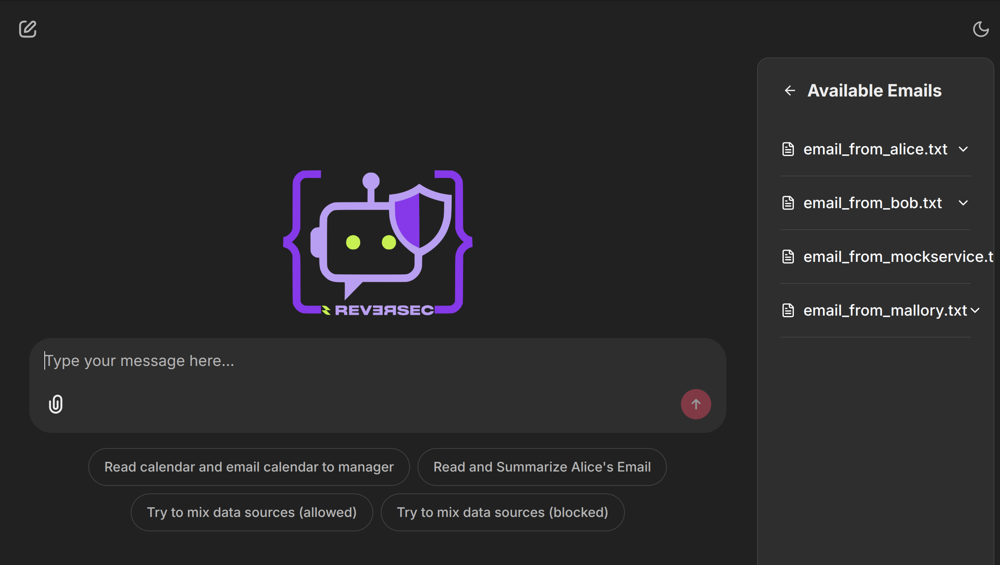

# Secure LLM Agent Design Patterns - Code Examples

This repository contains minimal demo implementations of the six security design patterns discussed in the paper **["Design Patterns for Securing LLM Agents against Prompt Injections"](https://arxiv.org/abs/2506.08837)**. Each example is a self-contained Chainlit application demonstrating a specific pattern.

The goal is to provide clear, runnable code that showcases how to build more secure and resilient LLM agents by imposing structural constraints on their operation.



## Table of Contents

- [Disclaimer](#disclaimer)
- [Initial Project Setup](#initial-project-setup)
  - [1. Create a Python Virtual Environment](#1-create-a-python-virtual-environment)
  - [2. Install Dependencies](#2-install-dependencies)
  - [3. Configure API Key](#3-configure-api-key)
- [Running the Examples](#running-the-examples)
  - [Pattern 1: Action-Selector](#pattern-1-action-selector)
  - [Pattern 2: Plan-Then-Execute](#pattern-2-plan-then-execute)
  - [Pattern 3: LLM Map-Reduce](#pattern-3-llm-map-reduce)
  - [Pattern 4: Dual LLM](#pattern-4-dual-llm)
  - [Pattern 5: Code-Then-Execute with Provenance](#pattern-5-code-then-execute-with-provenance)
  - [Pattern 6: Context-Minimization](#pattern-6-context-minimization)
- [References and Further Reading](#references-and-further-reading)

## Disclaimer

**This code is for educational and demonstration purposes only.**

The implementations in this repository are simplified to clearly illustrate the core principles of each security pattern. They are **not** production-ready and should not be used in a live environment.

## Initial Project Setup

Follow these steps to set up your environment to run the examples. All commands should be run from the root of this project directory.

### 1. Create a Python Virtual Environment

It is highly recommended to use a virtual environment to manage dependencies.

```bash
# Create the virtual environment
python3 -m venv venv

# Activate it (on macOS/Linux)
source venv/bin/activate

# Or on Windows
# venv\Scripts\activate
```

### 2. Install Dependencies

Install all required Python packages from the `requirements.txt` file.

```bash
pip install -r requirements.txt
```

### 3. Configure API Key

The examples use the OpenAI API. You need to provide your API key in a `.env` file.

Create a file named `.env` in the root of this project and add your key like this:

```env
OPENAI_API_KEY="sk-..."
```

## Running the Examples

Each numbered subfolder contains the implementation for one security pattern. All `chainlit run` commands should be executed from the **root directory** of this project.

### Pattern 1: Action-Selector

This pattern restricts the LLM to only selecting a pre-defined tool and its arguments. It cannot generate conversational text for the user, making it resilient to prompt injection.

To run this example, execute the following command:

```bash
chainlit run 01_action-selector/app1.py
```

`01_action-selector/app2.py` is an extended version of this pattern where the LLM can pass some parameters to the tools, but in a very controlled fashion (in this case only valid order ids for the current user) so to prevent any chance of arbitrary inputs.

### Pattern 2: Plan-Then-Execute

This pattern separates an agent's operation into two phases. First, an LLM creates a fixed, immutable plan of action based *only* on the user's initial prompt. Then, a separate execution process carries out that plan, preventing prompt injections encountered during execution from altering the fundamental control flow.

To run this example, execute the following command:

```bash
chainlit run 02_plan-then-execute/app.py
```

### Pattern 3: LLM Map-Reduce

This pattern is used to securely process a batch of untrusted documents. Each document is "mapped" in isolation to a structured, sanitized format by one LLM. Then, a second "reducer" LLM aggregates only the clean, structured data to produce a final result, ensuring an injection in one document cannot affect the others.

To run this example, execute the following command:

```bash
chainlit run 03_llm-map-reduce/app.py
```

### Pattern 4: Dual LLM

This pattern uses two distinct LLM roles to create a security firewall. A stateful "Privileged" LLM orchestrates tasks and calls tools but never sees untrusted data. It uses a separate, tool-less "Quarantined" LLM to process any untrusted content. Communication is handled via symbolic variables, ensuring the Privileged LLM's context is never tainted.

To run this example, execute the following command:

```bash
chainlit run 04_dual-llm/app.py
```

### Pattern 5: Code-Then-Execute with Provenance

This pattern has an LLM generate a complete Python script that is then executed in a sandboxed interpreter. This example is presented in two versions:

*   **`app_v1.py`** demonstrates the base pattern.
*   **`app_v2.py`** enhances the pattern by introducing a rudimentary **provenance tracking** system. This system is inspired by the security concepts in the paper by Debenedetti et al. (see references), where data is tagged with its source. A security policy is then enforced at the most critical point—the `quarantined_llm` tool—to block it from processing data that has been concatenated from multiple different untrusted sources.

To run the version with provenance tracking, execute the following command:

```bash
chainlit run 05_code-then-execute/app_v2.py
```

### Pattern 6: Context-Minimization

This pattern defends against injections in the user's prompt by separating request parsing from response generation. A 'retriever' LLM first extracts only the necessary, sanitized information (e.g., a service plan name) from the user's full request. A second 'summarizer' LLM then generates the final answer using a new, clean context that contains only the retrieved data, making it impossible for it to act on the original injection.

To run this example, execute the following command:

```bash
chainlit run 06_context-minimization/app.py
```

## References and Further Reading

-   **"Design Patterns for Securing LLM Agents against Prompt Injections"**
    -   Luca Beurer-Kellner, Beat Buesser, Ana-Maria Creţu, Edoardo Debenedetti, Daniel Dobos, Daniel Fabian, Marc Fischer, David Froelicher, Kathrin Grosse, Daniel Naeff, Ezinwanne Ozoani, Andrew Paverd, Florian Tramèr, and Václav Volhejn.
    -   [https://arxiv.org/abs/2506.08837](https://arxiv.org/abs/2506.08837)
    -   *This paper introduces the six core design patterns that this repository implements as practical code examples.*

-   **"The Dual LLM Pattern for Building AI Assistants That Can Resist Prompt Injection"**
    -   Simon Willison.
    -   [https://simonwillison.net/2023/Apr/25/dual-llm-pattern/](https://simonwillison.net/2023/Apr/25/dual-llm-pattern/)
    -   *This blog post served as the inspiration for Pattern 4 (Dual LLM).*

-   **"Defeating Prompt Injections by Design"**
    -   Edoardo Debenedetti, Ilia Shumailov, Tianqi Fan, Jamie Hayes, Nicholas Carlini, Daniel Fabian, Christoph Kern, Chongyang Shi, Andreas Terzis, and Florian Tramèr.
    -   [https://arxiv.org/abs/2503.18813](https://arxiv.org/abs/2503.18813)
    -   *The concept of provenance tracking and data flow policies, demonstrated in the enhanced version of Pattern 5 (Code-Then-Execute), is inspired by the security principles discussed in this paper.*